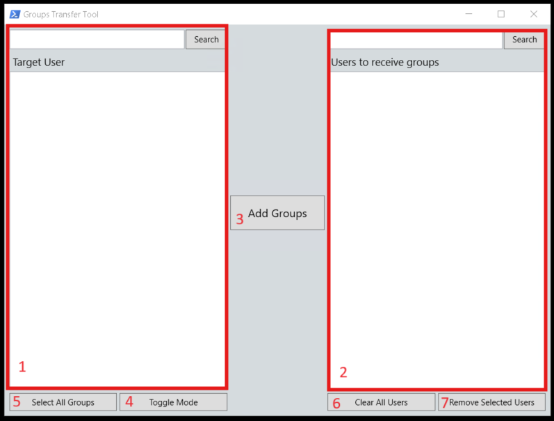

# AD-Group-Transfer-Tool

A powershell GUI script that makes group transfer between members in AD easy.

This tool is very useful for creating new users in an AD environment, as you can set up the user's groups from a target and copy them all over to the new user(s) all at once.

## Pre-requisites

This repo uses the WPF framework to create a GUI for powershell scripts that alter the groups of specific users.
  It requires `Windows.Markup.XamlReader`, so `.NET` is required for this script to work.
  It also relies on the `ActiveDirectory` module in Powershell, so that needs to be installed.

## How to use

1. The Left side of the tool is used to search a username with groups on the AD server that you are wanting to copy to other user(s).
    - Groups can be selected one at a time, or multiple at a time if you hold `CTRL`. You can also select a span of groups by holding `SHIFT`
2. The Right side of the tool is used for target users who you are wanting to transfer the groups on the left side to.
    - Users can be selected one at a time, or multiple at a time if you hold `CTRL`. You can also select a span of groups by holding `SHIFT`
3. The Button to transfer the selected groups from the original user to the target users.
4. This Button swaps the mode of the tool to add/remove the selected groups from the target user.
5. This Button selects all of the original users groups for copying.
6. This Button clears all of the users on the right side.
7. This Button clears only the selected user(s) from the right side.
