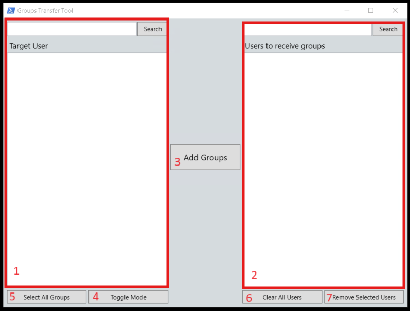

# AD Group Transfer Tool
 
A PowerShell + WPF GUI for copying, adding, or removing Active Directory group memberships between users — built for fast, error-free provisioning of new AD accounts.
 
Rather than manually cross-referencing a template user's groups and adding them one by one, this tool lets you pick a source user, select their groups, and apply them to one or more target users in a single action.
 
## Why this exists
 
Provisioning group access for new starters is a common, repetitive, error-prone task in AD administration — miss a group and a new hire loses access to something they need; copy the wrong ones and you've over-provisioned. This tool turns that into a guided, visual process usable even by team members without deep AD familiarity.
 
## Features
 
- Search and select a source user's group memberships
- Copy groups to one or more target users at once
- Add/remove mode toggle for adjusting existing group memberships, not just initial setup
- Multi-select support (single, `Ctrl`, and `Shift`-range selection) on both source and target sides
- Bulk actions: select all source groups, clear all targets, clear only selected targets
- Automatic logging of every transfer for auditing purposes

## Prerequisites
 
- **Windows with .NET Framework** — the GUI is built with WPF via `Windows.Markup.XamlReader`, which requires .NET to be present.
- **PowerShell** with the **ActiveDirectory module** installed. If it's not already available:
```powershell
  Install-WindowsFeature -Name RSAT-AD-PowerShell
```
  (or enable "RSAT: Active Directory Domain Services Tools" via Windows optional features, on non-server Windows)
- Permissions in AD sufficient to read and modify group memberships for the accounts you're working with.

## Installation
 
**Option A — Run directly:**
1. Clone or download this repo.
2. Run `groupTransferTool.ps1` in PowerShell.

**Option B — Use a compiled release:**
Pre-built `.exe` releases are available under [Releases](../../releases), built automatically via GitHub Actions on each tagged release. No PowerShell execution policy changes needed — just download and run.
 
## How to use
 

 
1. **Source panel (left)** — search for a username to pull their current AD group memberships.
   - Select one group at a time, hold `Ctrl` to multi-select individually, or `Shift` to select a range.
2. **Target panel (right)** — search for and select the user(s) you want to apply changes to.
   - Same selection rules apply: single click, `Ctrl` for multi-select, `Shift` for range select.
3. **Transfer button** — copies the selected groups from the source user onto the selected target user(s).
4. **Mode toggle** — switches the tool between copying groups and add/remove mode, for adjusting an existing user's groups rather than provisioning from scratch.
5. **Select All (source)** — selects every group on the source user for copying.
6. **Clear All (targets)** — clears every user currently listed on the target side.
7. **Clear Selected (targets)** — removes only the currently selected target user(s) from the list.

## Logging
 
Every group transfer is automatically logged to the current user's AppData folder - `%LOCALAPPDATA%\GroupTransferTool\Logs`, recording:
- Users added to groups
- Groups individually added to users
- Users removed from groups
- When the app is opened

This provides an audit trail without requiring any manual step from the person running the tool.

## Known limitations
 
- Requires domain-joined access with AD module connectivity.
- No dry-run/preview mode yet — review selections carefully before transferring.

## Roadmap
- Confirmation pop-up before applying group changes

